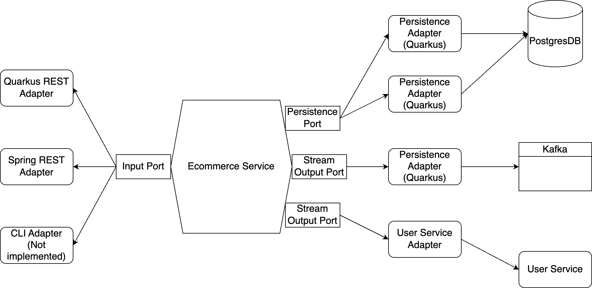

# Hexagonal Architecture Playground

This project is a microservice application that follows the principles of [Hexagonal Architecture](https://alistair.cockburn.us/hexagonal-architecture/), a design pattern designed to maximize maintainability, adaptability, and testability. By enforcing clear separation between core business logic and external dependencies, hexagonal architecture allows for easier modification, testing, and replacement of components, fostering a flexible, resilient system.

To highlight the advantages of hexagonal architecture, this project showcases a simple e-commerce product management service with two distinct implementations: one using Quarkus and another using Spring. Through these implementations, the project demonstrates how the architecture’s design principles support a high degree of modularity and adaptability across different frameworks.

# About the Project

## Architecture

The diagram below shows the architecture of the e-commerce service.



## Project Structure

```
.
├── ecommerce/         // the ecommerce service
    ├── src/
    └── ...
      └── ecommerce/
        ├── EcommerceService.java     // business logic
        ├── Product.java
        ├── adapters/                 // adapters that implement ports
        │   ├── quarkus/              // adapters using Quarkus
        │   │   └── ...
        │   └── spring/               // adapters using Spring
        │       └── ...
        ├── events/                   // kafka events
        │   └── ...
        └── ports/                    // ports that define how the service interact with outside world
            └── ...
├── infrastructure/    // some docker stuff
├── simple_user/       // the simple user service
```

# How to Run

## Step 0: Prerequisite

Make sure you have the following software installed:

* JDK 17 
* Maven
* Docker and Docker compose

## Step 1: Bring up the architecture

```shell script
cd infrastructure
docker-compose up -d
```

## Step 2: Run user service

When performing the product management logic, the ecommerce service communicates with user service to check the user privilege (which is simplified by only returning `true` :) ). To run the user service, run the following command: 

```shell script
cd simple_user
./mvnw quarkus:dev
```

## Step 3: Run unit tests

Go to another terminal and run the following command:

```shell script
cd ecommerce
./mvnw test
```

You should see 16 successful test run.

## Step 4: Run ecommerce service

As mentioned before, this project provides two implementations of the adapters using Quarkus and Spring. Therefore, you can run the service either by running:

```shell script
./mvnw quarkus:dev
```

or:

```shell script
./mvnw spring-boot:run
```

> **_NOTE:_**  Since this is only a POC project, we simplified the Spring implementation. This includes the service-to-kafka and service-to-user-service communication. 

> **_NOTE:_**  Terminal logging seems strange when running in Spring mode because we had to remove some conflicted logging dependency.

## Step 5: Make some API calls

Let's first add a new product:

```shell script
curl -X POST -d '{"name": "something new", "price": 999.99, "discount": 1.0}' -H "Content-Type: application/json" http://localhost:8080/api/ecommerce/product
```

You should see the UUID of the product in the response body. Let's use that to check the result:

```shell script
curl http://localhost:8080/api/ecommerce/product/{productId}
```

The exact same product should be returned. If you are running the service in Quarkus mode, you can also check the actual emission of the Kafka event in the Redpanda console at http://localhost:9090/topics/, which is brought up by the previous `docker-compose` command.

Next, you can also rename your product by:

```shell script
curl -X PUT -H "Content-type: application/json" -d 'new product name' http://localhost:8080/api/ecommerce/product/rename/{productId}
```

Or set the current discount of the product by:

```shell script
curl -X PUT -H "Content-type: application/json" -d '0.87' http://localhost:8080/api/ecommerce/product/discount/{productId}
```

Every rename and set-discount operation publishes a kafka event into the related topic.

# Conclusion

The e-commerce service is designed with Hexagonal Architecture, ensuring a clear separation between core business logic and external dependencies. In the source code of `EcommerceService.java`, you’ll notice it exclusively imports internal classes, reflecting the strong isolation of business logic. To integrate a new REST framework or data storage solution, developers only need to create a new adapter implementing `EcommerceInputPort.java` or `EcommercePersistencePort.java`, allowing flexibility in swapping or extending external components with minimal effort.

Hexagonal Architecture also enhances testability. When Hexagonal Architecture was first introduced around 2005, mocking dependencies for unit testing was less streamlined than it is today. Now, with modern mocking libraries like Mockito, testing complex applications has become much simpler, as demonstrated in `EcommerceServiceTest.java`. For a purer demonstration of Hexagonal Architecture’s testability benefits, `EcommerceServiceIndependentTest.java` shows how to test the service independently of external dependencies. Comparing these two test files highlights how both approaches achieve low code complexity, with the Hexagonal design ensuring focused, maintainable tests regardless of external changes.

While Hexagonal Architecture brings significant benefits, it also introduces some trade-offs, most notably added complexity in application code. This complexity arises from the architecture’s restriction on fully leveraging external frameworks, particularly in areas like dependency injection. For example, if the application were to depend entirely on Quarkus or Spring, dependency injection would be straightforward: `@Autowire` or `@Inject` could be used to inject dependencies like `EcommerceService::storage`, `EcommerceService::kafka`, and `EcommerceService::userService`. However, to adhere to Hexagonal principles, such annotations cannot be used. Even Jakarta EE’s `@Inject` is avoided, as it isn’t universally supported across frameworks. Instead, we create dedicated bean injection factories, such as `EcommerceBeanFactory.java` for Quarkus and `EcommerceBeanConfiguration.java` for Spring.

In summary, Hexagonal Architecture is most suitable for projects where adaptability to new technologies is critical. Its core principle of isolating business logic from external libraries makes it particularly flexible. While the architecture’s high testability was a significant advantage when it was first introduced, modern mocking libraries now provide similar benefits with even greater ease, making this aspect somewhat less impactful today.